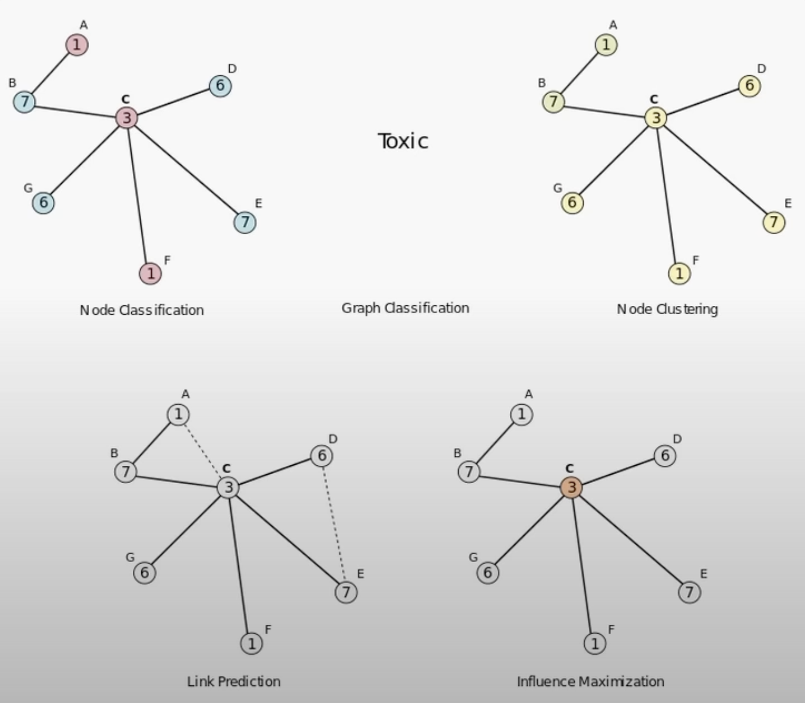

# Graph Neural Networks
Graph has vertices and edges such as $G = (V, E)$. It can have directed or undrected edges. Edge can also have weights. Each vertex or a node can be considered as a feature vector or embedding vector. Edge can also has a vector which can mean some bound or connection between nodes.

    

The most important ones are:
- Node classification
- Graph classification
- Link prediction (edge-level)

## GNN Representation
We can represent the GNN in a adjacency matrix where each point would be stored as a $(n, d)$ where $n$ is the the node and $d$ is the size vector that we represent specific node. If the adjacency matrix is symmetric from the diagonel, in other words when we transpose and get the same matrix it means the graph is undirected, otherwise it is directed.

One problem with the Graph is it being size independent. We can not simply resize the graph just like we do for let's say images. Therefore, we need a method that can handle arbitrary input shapes.

### Properties
- Permutation Invariance
- Permutation Equivariance

## Message-passing

We have node and edge properties which is stored in seperate vectors. Then using some method we obtain node level embeddings by combining the feature vectors.

1. Message
2. Aggregiation

### Graph Convolution Network

## Check later:
- Isomorphic graphs
- Message-passing

## Seq-HyGAN: Sequence Classification via Hypergraph Attention Network
LSTMs can struggle to capture the no-adjacent higher order and complex relations in the data.

